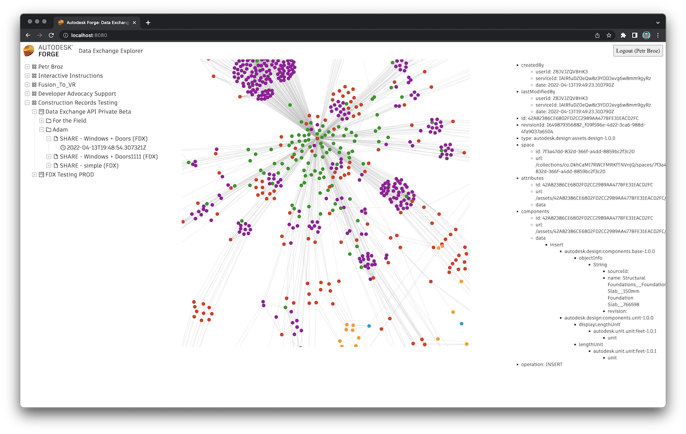

# fdx-graph-explorer

Simple explorer of [Autodesk Forge](https://forge.autodesk.com) Exchanges and their graphs.



## Development

### Prerequisites

- Autodesk Forge app credentials (see the [Create an App](https://forge.autodesk.com/en/docs/oauth/v2/tutorials/create-app) tutorial)
- Access to an [Autodesk Construction Cloud](https://construction.autodesk.com/) project (currently the Data Exchanges are only supported in this product)
- [Node.js](https://nodejs.org) (we recommend the LTS version), and [yarn](https://yarnpkg.com)
- Terminal (for example, [Windows Command Prompt](https://en.wikipedia.org/wiki/Cmd.exe), or [macOS Terminal](https://support.apple.com/guide/terminal/welcome/mac))

### Setup & Run

- Clone this repository
- Install dependencies: `yarn install`
- Setup env. variables:
  - `FORGE_CLIENT_ID` - your Forge application client ID
  - `FORGE_CLIENT_SECRET` - your Forge application client secret
  - `FORGE_CALLBACK_URL` - callback URL for the login workflow
    - When running locally, this should be `http://localhost:8080/api/auth/callback`
    - Also, make sure that you setup the exact same callback URL for your Forge app in https://forge.autodesk.com/myapps
  - `SERVER_SESSION_SECRET` - arbitrary string that will be used to encipher/decipher session cookies
  - `USE_CACHE` (optional) - when set to a non-empty string, the app will cache all Data Exchange responses,
  and respond with the cached data next time it is requested
- Run the app: `npm start`

> If you're using [Visual Studio Code](https://code.visualstudio.com), consider creating a _.vscode/launch.json_
> with the following content (replacing the placeholders with your actual env. var. values):
> ```
> {
>     "version": "0.2.0",
>     "configurations": [
>         {
>             "type": "pwa-node",
>             "request": "launch",
>             "name": "Launch Program",
>             "skipFiles": [
>                 "<node_internals>/**"
>             ],
>             "program": "${workspaceFolder}/server.js",
>             "env": {
>                 "FORGE_CLIENT_ID": "your-client-id",
>                 "FORGE_CLIENT_SECRET": "your-client-secret",
>                 "FORGE_CALLBACK_URL": "http://localhost:8080/api/auth/callback",
>                 "SERVER_SESSION_SECRET": "your-secret-phrase",
>                 "USE_CACHE": "true"
>             }
>         }
>     ]
> }
> ```
> Then you can easily run and debug the application right from the editor.
