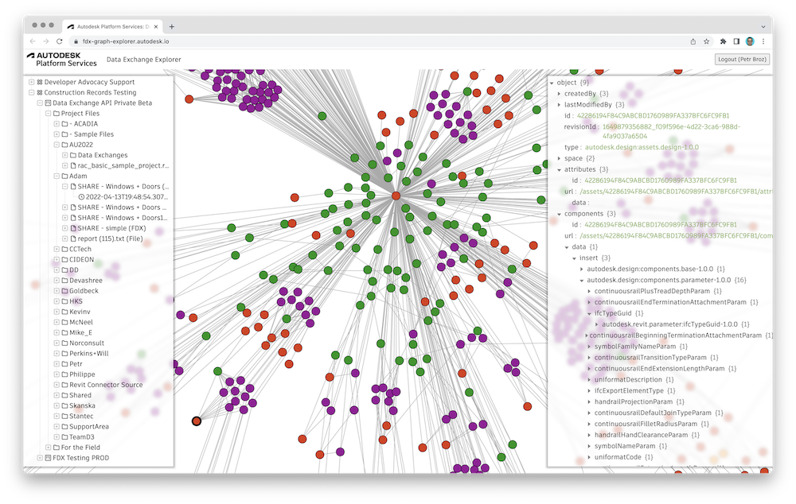

# Data Exchange Explorer


[](https://nodejs.org)
[](https://www.npmjs.com/)
[](https://opensource.org/licenses/MIT)

[](https://aps.autodesk.com/en/docs/fdx/v1/developers_guide/fd_overview)

Simple explorer of [Autodesk Platform Services](https://aps.autodesk.com) Data Exchanges and their graphs.



## Development

### Prerequisites

- APS credentials (see the [Create an App](https://aps.autodesk.com/en/docs/oauth/v2/tutorials/create-app) tutorial)
- Access to an [Autodesk Construction Cloud](https://construction.autodesk.com/) project (currently the Data Exchanges are only supported in this product)
- [Node.js](https://nodejs.org) (we recommend the LTS version), and [yarn](https://yarnpkg.com)
- Terminal (for example, [Windows Command Prompt](https://en.wikipedia.org/wiki/Cmd.exe), or [macOS Terminal](https://support.apple.com/guide/terminal/welcome/mac))

### Setup & Run

- Clone this repository
- Install dependencies: `yarn install`
- Setup env. variables:
  - `APS_CLIENT_ID` - your APS application client ID
  - `APS_CLIENT_SECRET` - your APS application client secret
  - `APS_CALLBACK_URL` - callback URL for the login workflow
    - When running locally, this should be `http://localhost:8080/api/auth/callback`
    - Also, make sure that you setup the exact same callback URL for your APS app in https://aps.autodesk.com/myapps
  - `SERVER_SESSION_SECRET` - arbitrary string that will be used to encipher/decipher session cookies
  - `USE_CACHE` (optional) - when set to a non-empty string, the app will cache all Data Exchange responses,
  and respond with the cached data next time it is requested
- Run the app: `npm start`

> If you're using [Visual Studio Code](https://code.visualstudio.com), consider creating a _.vscode/launch.json_
> with the following content (replacing the placeholders with your actual env. var. values):
> ```
> {
>     "version": "0.2.0",
>     "configurations": [
>         {
>             "type": "pwa-node",
>             "request": "launch",
>             "name": "Launch Program",
>             "skipFiles": [
>                 "<node_internals>/**"
>             ],
>             "program": "${workspaceFolder}/server.js",
>             "env": {
>                 "APS_CLIENT_ID": "your-client-id",
>                 "APS_CLIENT_SECRET": "your-client-secret",
>                 "APS_CALLBACK_URL": "http://localhost:8080/api/auth/callback",
>                 "SERVER_SESSION_SECRET": "your-secret-phrase",
>                 "USE_CACHE": "true"
>             }
>         }
>     ]
> }
> ```
> Then you can easily run and debug the application right from the editor.

## Troubleshooting

Submit your question via [APS Support Form](https://aps.autodesk.com/en/support/get-help).

## License

This sample is licensed under the terms of the [MIT License](http://opensource.org/licenses/MIT).
Please see the [LICENSE](LICENSE) file for more details.

## Author

Petr Broz, Developer Advocate
